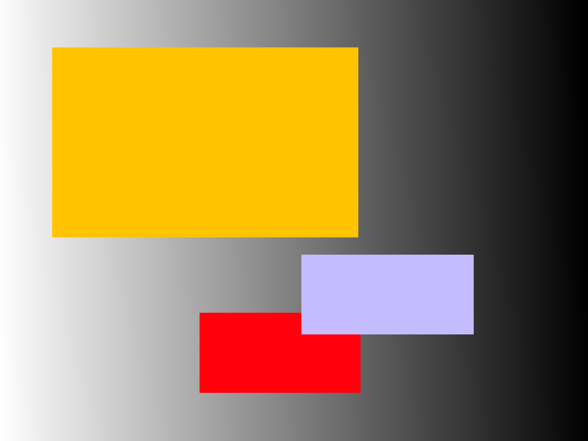
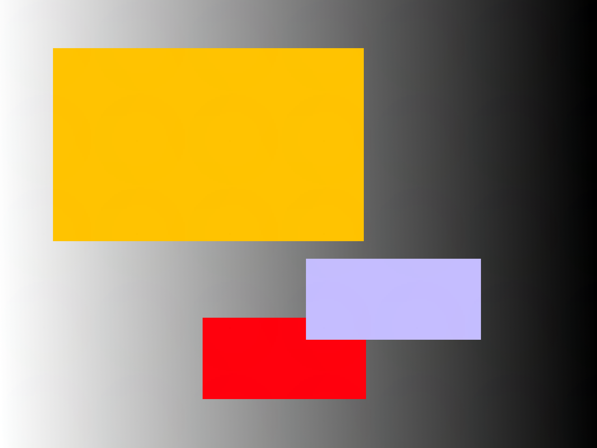
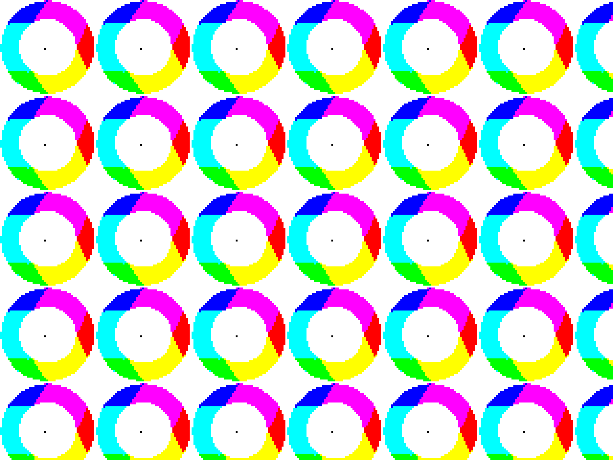
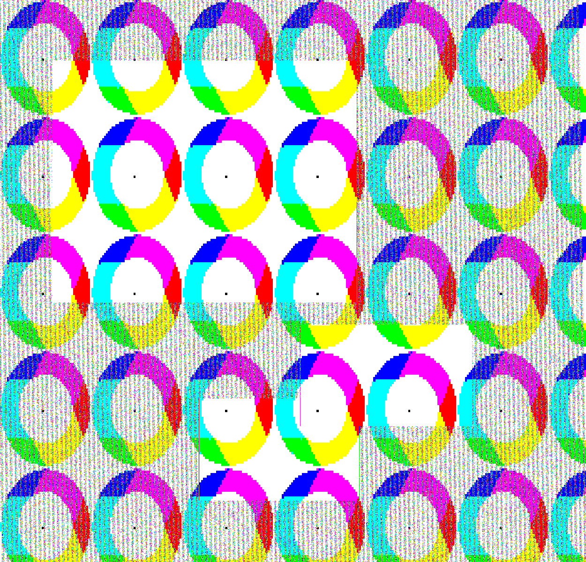

# stegomark
A package for watermarking images with images with LSB. (currently only works with pngs)

## How to use
```javascript
var stego = require('stegomark')
stego.write("in.png", "write.png", "out.png", {
  "callback": function () {
    stego.read("out.png", "extracted.png")
  }
})
```
## Functions
```javascript
stego.write(in_path, watermark_path, out_path[, options])
stego.read(in_path, extracted_path[, options])
```

## Options
* **`callback`**: to be called when the output image write is finished
* **`squeeze_protection`**: only on write - integer - the higher this integer, the more resistance to resizing

## How it works
The image watermark is rounded to 3-bit color - enough to fit in the LSBs of R, G, and B

For example, if we wanted to watermark the pixel with color FEB101 (orange) with another pixel of color FF006E (pink), the program would:

1. *Round the color to be watermarked* Essentialy, it divides the value of each color channel by 255, rounds to the nearest integer, and reconcatenates. This process results in a 3 bit color of 100, which expanded to 24 bit is FF0000 i.e. red
2. Take the 3 bit color and put it in the lowest bits of each channel of the original image. This results in a new color of FFB000 (very slightly different orange)
3. Repeat for all the watermark pixels

Reading does this in reverse.

## Why is this better?
1. In other LSB implementations, data stored in individual pixels is dependent on data from other pixels. However, by sacrificing color quality, we can store small, *independent* groups of data
2. (my opinion) I like the visual system more - rather than extracting a cryptic message, one can show the message in a visual form.

## Example!
The input image below:



Was watermarked with this and a squeeze protection of 5:


And created this output image:



That had this data:



### Testing against squeezing

I squeezed the output image in paint.net to get this:


But I was still able to extract this image:

